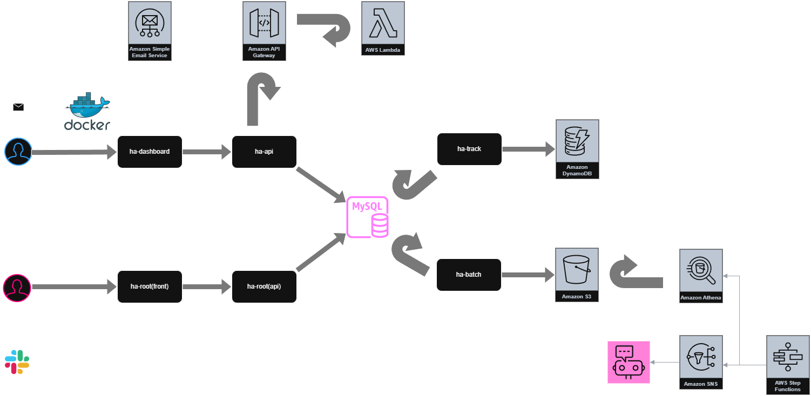

# work-3g
健康管理アプリ  

## 01_環境構築手順  
[環境構築手順](http://healthinfo-app-docs.s3-website-ap-northeast-1.amazonaws.com/wiki/localEnv)を参考にローカル環境構築を行う  

### 健康情報登録フロー

## 02_Project構成  
* ### ha-api  
健康管理のAPI。  
   - Java21
   - SpringBoot

* ### ha-dashboard  
健康管理のダッシュボード。   
   - Java21
   - SpringBoot
   - thymeleaf

* ### ha-batch  
健康管理のBatch処理。   
   - Java21
   - SpringBatch

* ### ha-root  
健康管理アプリの管理者用サイト。   
   - Java21
   - SpringBoot
   - Vue.js

* ### ha-business  
以下のプロジェクトで共通的に使うbusinessロジックを定義。  
| プロジェクト名 |
| :---- |
| ha-api |
| ha-batch |
| ha-dashboard |
| ha-root |

* ### ha-db  
以下のMavenプロジェクトで共通的に使うTableに対応したEntityとMapperのみを定義。  
環境へのDB反映は本プロジェクトよりFlywayで行う。  
| プロジェクト名 |
| :---- |
| ha-api |
| ha-batch |
| ha-business |
| ha-dashboard |
| ha-root |

* ### ha-common  
以下のMavenプロジェクトで共通的に使う共通処理を定義。  
| プロジェクト名 |
| :---- |
| ha-api |
| ha-batch |
| ha-business |
| ha-dashboard |
| ha-db |
| ha-root |

* ### ha-tool  
指定のフォーマットのExcelからDDL/DMLを自動生成するツールプロジェクト  
ツール関連はha-toolsへ移行。  

* ### ha-tools  
指定のフォーマットのExcelからDDL/DMLを自動生成するツールプロジェクト  

* ### ha-pom  
以下のプロジェクトで共通的に使う外部ライブラリを定義したpomプロジェクト。
| プロジェクト名 |
| :---- |
| ha-api |
| ha-batch |
| ha-business |
| ha-common |
| ha-dashboard |
| ha-db |
| ha-root |
| ha-tool |

* ### ha-track  
健康情報蓄積用プロジェクト。  
   - Python
   - Django rest framework

* ### ha-node  
健康情報計算を行うAPIプロジェクト。  
   - Java Script
   - Node.js
   -> API Gateway + Lambda化したためNode.jsのサーバ自体は廃止。  

* ### ha-build  
Docker環境でのBuild用のスクリプトを定義。   

* ### ha-docs  
健康管理アプリのドキュメントプロジェクト。  

* ### ha-asset  
詳細設計書、DDL等を定義したドキュメントプロジェクト。  

